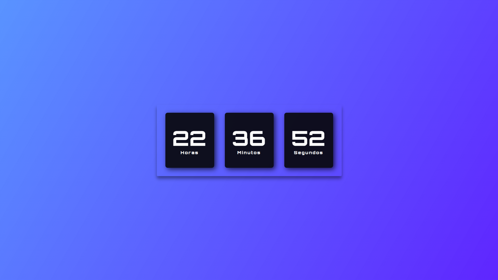

<h1 align="center">⏰ Relógio Digital</h1>

Projeto simples de um relógio digital em tempo real.

    <a href="#-projeto">Projeto</a>
    &nbsp;&nbsp;&nbsp;|&nbsp;&nbsp;&nbsp;
    <a href="#-tecnologias">Tecnologias</a>

## 💻 Projeto

O **Relógio Digital** é um projeto simples que exibe um relógio digital em tempo real. O relógio mostra as horas, minutos e segundos, atualizando automaticamente a cada segundo.

🌐 Acesse o projeto finalizado, online, através do [link](https://relogio-vhr.vercel.app/).

## 🚀 Tecnologias

Esse projeto foi desenvolvido com as seguintes tecnologias:

- HTML
- CSS
- JavaScript

## 📸 Preview

  

 

Feito com 💙 por <strong>Vitor Hugo</strong>

